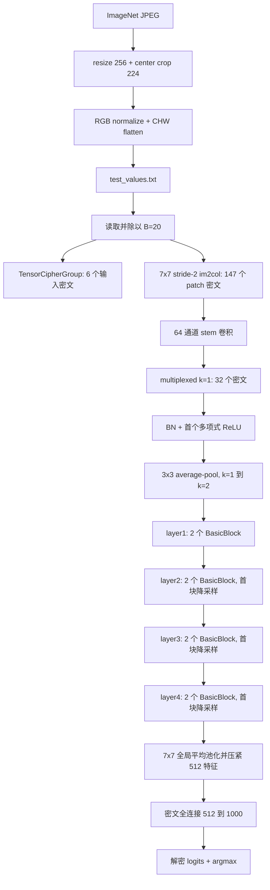

# ResNet-18 密态推理实现详解

本文说明 `Trident/resnet18` 中当前代码如何使用 Poseidon CKKS 完成 ImageNet
ResNet-18 密态推理。内容以代码中的真实执行路径为准，重点解释数据预处理、密文
布局、同态卷积、BN、Bootstrap、多项式 ReLU、残差连接、分类头和逐层误差检查。

> 当前程序是研究与正确性验证原型，不是 evaluator-only 的生产部署。正常模式下，
> 卷积、BN、ReLU、残差、池化和全连接均沿密文路径计算；但同一进程也持有私钥，
> 并会解密中间结果与明文参考值比较。因此，日志中的逐层解密不能视为生产环境的
> 隐私保护边界。

## 1. 总体目标

输入是一张经过 torchvision 风格预处理的 ImageNet 图片：

```text
3 × 224 × 224 = 150528 个实数
```

输出是 1000 个 ImageNet 类别 logits。程序最后解密 logits 并执行 `argmax`，得到
预测标签。

CKKS 适合近似实数的 SIMD 加减乘和 slot rotation，但不能直接执行比较操作。
当前实现采用以下方法把 ResNet-18 映射到 CKKS：

1. 将输入和中间激活统一缩放到边界 `B = 20` 对应的数值域。
2. 将卷积和 BN 的乘法系数融合，减少乘法深度。
3. 使用 multiplexed packing，把多个通道和空间位置交织进 CKKS slots。
4. 使用三段复合 Chebyshev 多项式近似阶跃函数，再计算 `x × step(x)` 近似 ReLU。
5. 除 stem 第一个 ReLU 外，每个 ReLU 前执行当前 14-level Bootstrap，恢复模数层级。
6. 用 HE 友好的 average-pool 替换 stem 中需要比较的 max-pool。
7. 同步运行明文参考路径，在每个主要算子后解密并计算最大绝对误差。

完整流程如下：



## 2. 主要代码文件

| 文件 | 作用 |
| --- | --- |
| `resnet18.cpp` | 解析图片 ID 范围，调用密态推理入口 |
| `infer.cpp` | 组织完整网络、密文布局、各层计算、密钥规划和误差日志 |
| `infer_config.*` | 网络常量、CKKS 参数、Q/P 模数链和 ReLU 配置 |
| `infer_runtime.*` | 创建 context、encoder、encryptor、decryptor、evaluator 和密钥 |
| `parameter_loader.*` | 读取预处理输入、标签及 torchvision 导出的模型参数 |
| `tensor_cipher_group.*` | 将放不进单个密文的原始图片按通道切成多个密文 |
| `encrypted_group_ops.*` | stem 的 im2col 加密和首个 `7×7` 卷积 |
| `encrypted_ops.*` | 单密文 Bootstrap、ReLU 和分类头矩阵乘法 |
| `relu_approx.*` | 读取多项式系数并执行明文/密文 Chebyshev 近似 |
| `plain_cnn.*` | 与密文路径同步的明文参考实现 |
| `progress_log.*` | 记录时间、chain index、scale、进度和误差 |
| `parallel_utils.h` | 按输出 pack 或通道执行受控并行 |
| `resnet18_plain.cpp` | 不使用同态加密的完整网络验证入口 |

## 3. 输入图片如何进入 C++ 推理

### 3.1 JPEG 只用于离线预处理

运行时的 C++ 程序不会直接读取 `testFile/val/*.JPEG`，而是读取：

```text
Trident/resnet18/testFile/test_values.txt
Trident/resnet18/testFile/test_label.txt
```

原始 JPEG、ImageNet 映射文件和 CSV 标签用于重新生成这些运行时输入，因此属于
可复现预处理资产，并不是无用数据。

### 3.2 Python 预处理

`prepare_imagenet_val_subset.py` 对每张图片执行：

```text
RGB 转换
→ 短边 resize 到 256
→ 中心裁剪为 224×224
→ 像素除以 255
→ 使用 ImageNet mean/std 标准化
→ 按 C,H,W 顺序展平
```

ImageNet 标准化参数为：

```text
mean = (0.485, 0.456, 0.406)
std  = (0.229, 0.224, 0.225)
```

生成数据的通用命令为：

```bash
python3 Trident/resnet18/prepare_imagenet_val_subset.py
```

`test_manifest.txt` 保存 C++ `image_id`、JPEG 文件名、synset 和整数标签之间的关系。
例如 `image_id=0` 对应排序后的第一张图片，而不是 ImageNet 文件名中的零号图片。

### 3.3 边界缩放

`read_plain_image_values()` 读取一张图片的 150528 个值，并逐值除以：

```text
B = kResNet18Boundary = 20
```

设预处理后的原始值为 `x`，进入密文网络的是：

```text
x_scaled = x / B
```

ReLU 具有正齐次性，因此在近似误差可控的前提下：

```text
ReLU(x / B) ≈ ReLU(x) / B
```

网络主体始终在缩放域计算。分类头的全局平均池化会乘回 `B`，使 512 个特征恢复
到 torchvision FC 权重所期望的数值尺度。

## 4. ResNet-18 网络结构

当前实现是 BasicBlock 版 ResNet-18：

```text
stem:
    7×7 conv, stride 2, 3→64
    BN
    polynomial ReLU
    3×3 average-pool, stride 2, padding 1

layer1: 2 × BasicBlock, 64 channels
layer2: 2 × BasicBlock, 128 channels, 第一个 block stride 2
layer3: 2 × BasicBlock, 256 channels, 第一个 block stride 2
layer4: 2 × BasicBlock, 512 channels, 第一个 block stride 2

head:
    global average pool
    fully connected 512→1000
```

普通 BasicBlock 为：

```text
x ───────────────────────────────┐
│                                │
├→ 3×3 conv → BN → ReLU          │
│  → 3×3 conv → BN               │
│                                │
└──────── residual add ←─────────┘
                  → ReLU
```

`layer2`、`layer3`、`layer4` 的第一个 block 同时执行空间降采样和通道扩展，shortcut
使用 `1×1, stride=2` projection convolution 加 BN。`layer1` 的输入输出都是 64
通道，因此使用 identity shortcut。

各阶段逻辑形状为：

| 位置 | 逻辑形状 `C×H×W` | `k` | 每密文最大通道数 | 密文数 |
| --- | ---: | ---: | ---: | ---: |
| stem conv packed | `64×112×112` | 1 | 2 | 32 |
| stem avgpool | `64×56×56` | 2 | 8 | 8 |
| layer1 输出 | `64×56×56` | 2 | 8 | 8 |
| layer2 输出 | `128×28×28` | 4 | 32 | 4 |
| layer3 输出 | `256×14×14` | 8 | 128 | 2 |
| layer4 输出 | `512×7×7` | 16 | 512 | 1 |
| head pooled | `512×1×1` | - | 512 个连续 slots | 1 |
| logits | `1000×1×1` | - | 前 1000 个 slots | 1 |

标准 torchvision stem 使用 max-pool。CKKS 无法直接比较 9 个候选值，因此密态路径
改用 `3×3, stride=2, padding=1` average-pool；明文参考路径使用相同算子，保证
逐层比较的是同一网络。

## 5. CKKS 参数和模数链

默认参数来自 `default_poseidon_plan()`：

| 参数 | 当前值 | 含义 |
| --- | ---: | --- |
| `logN` | 16 | 环维度 `N = 2^16` |
| `log_slots` | 15 | CKKS slot 数为 `2^15 = 32768` |
| `log_scale` | 46 | 常规计算 scale 约为 `2^46` |
| `init_p` | 8 | 推理计划中保留的初始 packing 参数 |
| `boot_level` | 14 | 推理计划中的 Bootstrap 层级配置 |
| `B` | 20 | 激活边界缩放 |

Q 模数链按从低层到高层的顺序由以下素数组成：

```text
q0:                   1 × 51-bit prime
常规计算区:          20 × 46-bit primes
Bootstrap 专用尾部: 14 × 51-bit primes
```

也就是 Q 一共 35 个素数。这里“14 个 51-bit 模数”专指 Bootstrap 使用的尾部
模数；新 Bootstrap 还要求一个独立的 51-bit `q0`，所以若按整个 Q 链统计，51-bit
条目总数是 15 个。`q0` 是自举输入基准层，不属于 14-level 自举预算。

ResNet-18 的首段现在与 ResNet-50 使用相同的 level 策略：新密文不立即丢弃顶部
14 个 51-bit 模数，而是先让 stem 卷积和 multiplexed 重排消耗其中 3 层。到第一
个 ReLU 前，`drop_trailing_51_bit_primes()` 再丢弃剩余的 11 个连续 51-bit
模数，使密文落到 46-bit 常规计算区顶部。

第一次 Bootstrap 前的实际 level 变化如下：

```text
新加密的 stem im2col 密文                 chain_index 34
stem 7×7 conv（消耗顶部 51-bit 模数）    34 -> 33
stem 输出重排为 multiplexed k=1（2 层）   33 -> 31
ReLU 前丢弃剩余 11 个 51-bit 模数          31 -> 20
stem 复合多项式 ReLU（14 层）              20 -> 6
stem 3×3 average-pool（2 层）               6 -> 4
layer1 block0 conv1（含 BN scale，2 层）     4 -> 2
第一次 Bootstrap 输入                       chain_index 2
```

因此首段虽然在第一次 Bootstrap 前总共发生 21 次 rescale，但其中最前面的 3 次
由 Bootstrap 尾部的 51-bit 模数承担；46-bit 常规计算区只需 20 个模数，并且在
第一次 Bootstrap 前仍保留到 `chain_index=2`。这比“输入阶段立即丢弃全部 51-bit
尾部”的方案节省了一个 46-bit 模数，同时避免 layer1 block0 conv1 在 q0 上编码
明文时出现 `scale out of bounds`。

特殊模数 P 为：

```text
1 × 51-bit prime
```

新加密的输入位于模数链顶部。首段特意保留 51-bit 尾部供 stem 卷积和重排使用，
在第一个 ReLU 前才调用 `drop_trailing_51_bit_primes()`。Bootstrap 会把密文刷新
回较高层级，后续 ReLU 仍会执行相同的 51-bit 尾部处理。

每次密文乘明文权重或密文乘密文后都要结合 rescale 管理 scale；纯加法、rotation
和使用 scale 对齐的 `add_plain` 不消耗相同的乘法深度。

## 6. 运行时与密钥准备

`make_poseidon_runtime()` 创建：

- Poseidon CKKS context；
- `CKKSEncoder`；
- public key 和 secret key；
- `Encryptor` 与 `Decryptor`；
- `EvaluatorCkksBase`；
- relinearization keys；
- Galois rotation keys；
- 最新 Bootstrap 使用的 `BootstrapConfig`。

当前 factory 明确选择 `DEVICE_SOFTWARE`。

正式入口先用 `generate_evaluation_keys=false` 创建基础 runtime，再由
`prepare_resnet18_evaluation_keys()` 一次性生成 relinearization keys 和完整的
二次幂 rotation/conjugation Galois keys。这样不会在每个卷积、池化或 Bootstrap
阶段重复创建密钥。

### 6.1 网络 rotation keys

默认 Galois key 生成接口会准备：

- CKKS slot 数范围内的正负二次幂 rotation keys；
- conjugation key。

`rotate_with_power_of_two_keys()` 会把任意 rotation step 分解成若干二进制位，依次
应用已有的二次幂 Galois keys。因此网络中的 `±112×112` 页面移动和全连接 rotation
不需要逐个生成直接 key。

### 6.2 Bootstrap rotation keys

Bootstrap 内部的 CoeffToSlot、SlotToCoeff 和实数投影同样使用上述二次幂 rotation
及 conjugation keys。rotation 分解和自举内部矩阵均由 Poseidon 最新 Bootstrap
实现负责，ResNet-18 不再维护独立的 DFT rotation-key 规划逻辑。

日志会记录：

```text
galois_key_mode=power_of_two_rotations_and_conjugation
prepare evaluation keys time
```

## 7. 三种主要密文布局

### 7.1 `TensorCipherGroup`：原始输入的 6 个密文

一张图片有 150528 个值，而一个 CKKS 密文只有 32768 个 slots，不能放进一个密文。
`TensorCipherGroup` 按通道切分：

```text
每通道值数 = 224×224 = 50176
每通道 chunks = ceil(50176 / 32768) = 2
总 chunks = 3×2 = 6
```

每个 chunk 的有效值从 slot 0 开始排列，其余 slots 填 0。这个输入组用于证明完整
图片能够按当前 `logN=16` 参数加密、解密和恢复 CHW 顺序。

### 7.2 `Im2ColCipherGroup`：stem 卷积输入

首层是 `7×7, stride=2, padding=3`，输出空间为：

```text
112×112 = 12544
```

代码为每个 `(input_channel, kernel_row, kernel_col)` 生成一个 patch 密文：

```text
3 × 7 × 7 = 147 个密文
```

第 `(oh, ow)` 个 active slot 保存：

```text
input[ic, oh×2 + kh - 3, ow×2 + kw - 3]
```

越界位置保持为 0，实现 padding。每个 patch 密文只使用前 12544 个 slots。

需要注意：`TensorCipherGroup` 和 `Im2ColCipherGroup` 都从同一份明文输入构造。
前者用于验证原始输入的多密文切分，后者是当前 stem 卷积真正消费的布局。

### 7.3 `ChannelCipherGroup`：stem 输出过渡布局

首层卷积产生 64 个输出通道，每个通道一个密文：

```text
64 ciphertexts × 12544 active slots
```

该布局只在 stem 卷积输出阶段使用，随后会被打包为 multiplexed 布局。

### 7.4 `MultiplexedCipherGroup`：网络主体布局

网络主体使用：

```cpp
struct MultiplexedCipherGroup {
    int h, w, c;
    int k;
    int pages_per_cipher = 2;
    size_t page_size;
    size_t slot_count;
    vector<Ciphertext> packs;
};
```

关键关系为：

```text
每页通道数       = k²
每密文页数       = 2
每密文最大通道数 = 2k²
page_size         = (H×k) × (W×k)
密文数            = ceil(C / (2k²))
```

通道 `channel` 的页内偏移为：

```text
channels_per_page = k²
page              = channel / k²
local_channel     = channel mod k²
local_page        = page mod 2
row_offset        = local_channel / k
col_offset        = local_channel mod k
```

逻辑位置 `(channel, row, col)` 对应：

```text
slot = local_page × page_size
     + (row×k + row_offset) × (W×k)
     + (col×k + col_offset)
```

### 7.5 为什么降采样时 `k` 加倍

stride 2 会使 `H、W` 各减半，同时代码设置：

```text
k_out = 2 × k_in
```

所以：

```text
H_out × k_out = H_in × k_in
W_out × k_out = W_in × k_in
```

从 stem 到 layer4，`page_size` 始终保持：

```text
112 × 112 = 12544 slots
```

两个 active pages 最多使用 25088 个 slots，小于 32768。空间尺寸越小，单个密文
能够容纳的通道数越多，因此密文数从 32 逐步减少到 1。

## 8. Stem 密态计算

### 8.1 输入加密和检查

程序首先构造 6-chunk `TensorCipherGroup`，跳过顶部连续 51-bit primes，然后解密
检查：

```text
input decrypt max_abs_error
```

这个检查验证多密文切分和 CKKS 编解码，但 stem 卷积使用后续的 im2col 密文。

### 8.2 im2col 卷积

`encrypted_conv2d_im2col_all_channels()` 为 64 个输出通道并行计算：

```text
folded_scale[oc] = gamma[oc] / sqrt(var[oc] + epsilon)

conv[oc] = Σ(ic,kh,kw)
    patch_cipher[ic,kh,kw]
    × weight[oc,ic,kh,kw]
    × folded_scale[oc]
```

权重和 `folded_scale` 是明文标量。每项使用 `multiply_plain`，随后 rescale 并累加。
这一阶段已经融合 BN 的乘法部分，但尚未加入 BN 的均值和 bias offset。

### 8.3 打包为 `k=1`

64 个逐通道密文通过 `pack_channel_group_as_multiplexed_k1()` 合并为 32 个密文。
每个密文保存两页：

```text
page 0: 一个 112×112 通道
page 1: 下一个 112×112 通道
```

打包只使用 binary mask、rotation 和 add，不改变张量数值。

### 8.4 BN offset

普通 BN 为：

```text
BN(z) = gamma × (z - mean) / sqrt(var + epsilon) + beta
```

卷积已经融合：

```text
gamma / sqrt(var + epsilon)
```

因此 `multiplexed_channel_batch_norm()` 只需为每个有效 slot 加：

```text
offset = (beta - mean × gamma / sqrt(var + epsilon)) / B
```

offset 作为与密文相同 `parms_id` 和 scale 的明文向量编码，再通过 `add_plain`
加入，不额外消耗乘法层级。

### 8.5 首个 ReLU

stem 的第一个 ReLU 直接执行同态多项式，不先 Bootstrap：

```text
stem BN → polynomial ReLU
```

这是整个网络唯一不在 ReLU 前刷新模数链的激活点。

### 8.6 average-pool

`multiplexed_average_pool2d_stride2()` 对 3×3 窗口的 9 个位置分别：

1. rotation 对齐源 slot 与目标 slot；
2. binary mask 保留有效位置；
3. 将 9 项相加；
4. 乘以 `1/9` 并 rescale。

输出从：

```text
64×112×112, k=1, 32 ciphertexts
```

变成：

```text
64×56×56, k=2, 8 ciphertexts
```

## 9. BasicBlock 的密态实现

每个 BasicBlock 的正式路径为：

```text
main branch:
    encrypted 3×3 conv1 with folded BN scale
    → encrypted BN offset
    → Bootstrap
    → polynomial ReLU
    → encrypted 3×3 conv2 with folded BN scale
    → encrypted BN offset

shortcut:
    identity
    或 encrypted 1×1 stride-2 projection + BN offset

main + shortcut
    → Bootstrap
    → polynomial ReLU
```

ResNet-18 有 8 个 BasicBlock，每个 block 有两个激活点，因此网络主体共有 16 个
“Bootstrap + ReLU”逻辑位置。

### 9.1 Multiplexed 卷积

`multiplexed_channel_conv2d_all_channels()` 同时支持 stride 1 和 stride 2：

- 根据 kernel offset 对输入 pack 做 rotation；
- 为一个输入 pack 中的多个输入通道构造 compact plaintext weight vector；
- 执行密文乘明文和 rescale；
- 在输入通道、kernel 位置和输入 packs 上累加；
- 把局部通道结果 rotation 到目标通道的 multiplexed slot；
- 使用选择向量写入目标输出 pack；
- 在选择向量中同时乘入 BN 的 `gamma/sqrt(var+epsilon)`。

相比“每个输入通道、每个输出通道、每个 kernel 点各做一次独立密文操作”，
compact vector 会在同一次 `multiply_plain` 中利用 SIMD slots 承载多个权重位置。

### 9.2 stride 2 与 projection shortcut

stage 首块的主分支 conv1 使用 stride 2：

```text
layer2: k 2→4,   64→128 channels, 56→28
layer3: k 4→8,  128→256 channels, 28→14
layer4: k 8→16, 256→512 channels, 14→7
```

同一 block 的 shortcut 使用 `1×1, stride=2` 卷积和独立 BN 参数，产生与主分支
完全一致的 `H、W、C、k、page_size、packs`，才能执行残差相加。

### 9.3 残差相加

`multiplexed_channel_add()` 首先检查两个输入的布局元数据完全一致。如果两侧处于
不同 chain index，则把较高一侧 drop 到较低一侧的 `parms_id`，再执行
`add_dynamic` 完成 scale/level 对齐后的密文加法。

## 10. 多项式 ReLU

### 10.1 配置

当前 ReLU 配置为：

```text
component_count = 3
degrees         = {15, 15, 27}
alpha           = 13
scaled_val      = 1.7
evaluation tree = OddBaby
coefficient file = relu_param/d13.txt
```

### 10.2 计算过程

`approximate_sign()` 从 `d13.txt` 依次读取三段系数，并使用 Chebyshev 多项式和
OddBaby 求值树复合计算：

```text
p(x) = p3(p2(p1(x))) + 0.5
```

这里的 `p(x)` 近似阶跃函数。最终 ReLU 为：

```text
ReLU_approx(x) = x × p(x)
```

密文实现需要：

- Chebyshev 递推中的密文乘密文；
- relinearization；
- rescale；
- 不同中间项之间的 level/scale 对齐；
- 最后一次 `input × mask`。

明文参考路径调用 `approximate_relu_plain()`，使用相同系数、相同 degree 和相同
求值树，而不是使用精确的 `max(0,x)`。因此逐层误差主要衡量 CKKS 近似误差，
不会把“精确 ReLU 与多项式 ReLU 的函数差异”混入密文误差。

## 11. Bootstrap

### 11.1 为什么需要 Bootstrap

卷积的明文乘法和 ReLU 的多项式求值持续消耗模数层级。若只进行 leveled HE，
模数链无法支持 18 层网络中的所有复合激活。当前实现因此在每个 BasicBlock 的
两次 ReLU 前刷新密文。

### 11.2 当前 API 和参数

当前代码只构造 `BootstrapConfig`，并将其传给最新 Bootstrap 接口。默认配置为：

```text
boundary_k            = 25
log_message_ratio     = 5
double_angle          = 2
scaling_log           = 51
output_ratio          = 32
project_real          = true
inverse_coeff         = 0.0
```

模数参数同时设置 `q0_level=0`，并由运行时在创建 context 前强制校验 Q 链必须严格
满足 `1×51 + 20×46 + 14×51`，避免配置看似能启动、实际在自举中途耗尽 level。

### 11.3 14-level Bootstrap 和输出 scale 归一化

`bootstrap_tensor()` 调用：

```text
evaluator.bootstrap(..., BootstrapConfig)
```

最新实现内部依次完成模数提升、CoeffToSlot、模约减、SlotToCoeff；因为
`project_real=true`，实数投影也在 Bootstrap 内部完成，不再由 ResNet-18 额外执行
一次 `(x + conjugate(x)) / 2`。

Bootstrap 返回后，`normalize_bootstrap_output_scale()` 检查输出 scale 是否等于
context 的常规 `2^46` scale。若不一致，它用当前层最后一个模数计算保持明文值不变
的常数 scale，执行一次 `multiply_const + rescale`，再验证并固定到目标 scale。
这样后续复合多项式 ReLU 始终从统一 scale 开始。

### 11.4 执行粒度

Bootstrap 按 multiplexed pack 执行，而不是按逻辑通道执行。各 stage 每个激活点的
pack 数分别为 8、4、2、1，所以 16 个逻辑 Bootstrap 位置对应总计 60 次 pack 级
Bootstrap：

```text
layer1: 2 blocks × 2 activations × 8 packs = 32
layer2: 2 blocks × 2 activations × 4 packs = 16
layer3: 2 blocks × 2 activations × 2 packs = 8
layer4: 2 blocks × 2 activations × 1 pack  = 4
```

## 12. 分类头

### 12.1 全局平均池化

layer4 最终输出为：

```text
512×7×7, k=16, 1 ciphertext
```

`encrypted_multiplexed_head_average_pool()` 分三步处理：

1. 对 7 列做 rotation、mask 和累加；
2. 对 7 行做 rotation、mask 和累加；
3. 把每个通道的 `(row=0,col=0)` slot 移动到连续 slots `0..511`。

最后乘：

```text
B / (7×7) = 20 / 49
```

其中 `/49` 是全局平均，乘 `B` 用于撤销网络主体的边界缩放。结果是一个
`TensorCipher`，前 512 个 slots 保存分类特征。

### 12.2 512→1000 全连接

`matrix_multiplication()` 使用对角线法计算：

```text
logits = W(1000×512) × features(512) + bias(1000)
```

对于 `1000×512` 矩阵，共遍历：

```text
1000 + 512 - 1 = 1511 个对角线位置
```

每个位置执行：

1. 将特征密文 rotation 到对应对角线；
2. 构造一个明文对角权重向量；
3. `multiply_plain` 并 rescale；
4. 累加所有对角线结果；
5. 通过 `add_plain` 加入 1000 维 bias。

输出密文的前 1000 个 slots 即 1000 个 logits。程序解密这些 slots，计算
`argmax`，并与明文分类头和真实标签比较。

## 13. 明文参考、解密检查和误差

当前实现几乎在每个重要节点都同步计算明文参考：

```text
plain_convolution
plain_batch_norm
plain_polynomial_relu_reference
plain_average_pool2d
plain_add
plain_average_pool
plain_fully_connected
```

密文结果通过 `Decryptor` 和 `CKKSEncoder::decode()` 恢复，然后计算：

```text
max_abs_error = max_i |cipher_value[i] - plain_value[i]|
```

日志还会记录复数解码值的实部和虚部预览。主要检查项包括：

- 输入加解密误差；
- stem conv、BN、ReLU、average-pool 误差；
- 每个 block 的 conv1、BN1、ReLU1、conv2、BN2；
- projection shortcut；
- residual add 和 block 输出 ReLU；
- Bootstrap 前后自误差；
- 全局平均池化误差；
- logits 最大绝对误差；
- 明文预测、密文预测和真实标签。

这种设计非常适合定位某一层首次出现的误差放大，但意味着当前程序不是只让服务端
持有公钥和 evaluation keys 的生产部署。

## 14. 运行日志与并行

密态推理日志写入：

```text
Trident/resnet18/result/resnet18_imagenet_run_<start>_<end>_<timestamp>.txt
```

日志包含：

- CKKS 参数和密钥准备时间；
- 每个密文组的形状、pack 数、chain index 和 scale；
- 每个算子的开始时间、结束时间和耗时；
- Bootstrap、ReLU 和卷积的 pack 进度；
- 每层误差和最终预测；
- 单张图片及整个区间的总时间。

卷积、BN、残差和部分布局转换会按 pack 并行。默认线程数是硬件线程数与 8 的较小值，
可以显式控制：

```bash
RESNET18_THREADS=4 ./Trident/build/resnet18/resnet18 0 0
```

增加线程数会提高并发内存占用，不一定线性加速。

## 15. Mock 模式

代码提供两个诊断环境变量：

```bash
RESNET18_MOCK_BOOTSTRAP=1
RESNET18_MOCK_RELU=1
```

组合示例：

```bash
RESNET18_MOCK_BOOTSTRAP=1 RESNET18_MOCK_RELU=1 \
  ./Trident/build/resnet18/resnet18 0 0
```

行为如下：

- Mock Bootstrap：解密当前值，再重新编码和加密；
- Mock ReLU：解密、执行明文多项式、重新加密。

这些模式用于隔离问题和缩短调试时间，不属于密态推理，也不能用于安全性或性能结论。
默认不设置环境变量时才是同态 Bootstrap 和同态多项式 ReLU。

## 16. 构建与运行

以下命令均使用仓库相对路径，不依赖某个用户的绝对目录。

### 16.1 构建

从项目仓库根目录执行：

```bash
cmake -S Trident -B Trident/build -DRESNET18=ON
cmake --build Trident/build --target resnet18 -j2
cmake --build Trident/build --target resnet18_plain -j2
```

### 16.2 先运行明文基线

```bash
./Trident/build/resnet18/resnet18_plain 0 0
```

明文入口默认使用与密态路径一致的 average-pool stem。若要单独对比 torchvision
标准 max-pool stem：

```bash
./Trident/build/resnet18/resnet18_plain 0 0 maxpool
```

### 16.3 运行密态推理

```bash
./Trident/build/resnet18/resnet18 START_IMAGE_ID END_IMAGE_ID
```

起止 ID 是闭区间。第一次建议只运行一张：

```bash
./Trident/build/resnet18/resnet18 0 0
```

完整同态 Bootstrap 和复合 ReLU 计算量很大，运行时间和内存占用会显著高于明文入口。

## 17. 一张图片的执行伪代码

```text
create CKKS runtime without evaluation keys
collect network + bootstrap rotation steps
generate relin keys, Galois keys, bootstrap polynomial

for image_id in [start, end]:
    x = read test_values[image_id] / B
    label = read test_label[image_id]

    input_chunks = encrypt TensorCipherGroup(x)       # 6 ciphertexts
    verify decrypt(input_chunks) against x

    patches = encrypt im2col(x, 7×7, stride=2)       # 147 ciphertexts
    stem = encrypted_conv(patches, conv1, folded BN) # 64 channel ciphertexts
    stem = pack_as_multiplexed_k1(stem)              # 32 ciphertexts
    stem = encrypted_bn_offset(stem)
    stem = encrypted_polynomial_relu(stem)            # no bootstrap
    stem = encrypted_avgpool_3x3_stride2(stem)        # k=2, 8 ciphertexts

    state = stem
    for stage in [1, 2, 3, 4]:
        for block in [0, 1]:
            shortcut = state
            stride = 2 only for stage>1 and block==0

            branch = encrypted_conv3x3(state, stride, folded BN)
            branch = encrypted_bn_offset(branch)
            branch = bootstrap(branch)
            branch = encrypted_polynomial_relu(branch)

            branch = encrypted_conv3x3(branch, stride=1, folded BN)
            branch = encrypted_bn_offset(branch)

            if projection is required:
                shortcut = encrypted_conv1x1(state, stride=2, folded BN)
                shortcut = encrypted_bn_offset(shortcut)

            state = encrypted_add(branch, shortcut)
            state = bootstrap(state)
            state = encrypted_polynomial_relu(state)

    features = encrypted_global_average_pool_and_compact(state)
    logits = encrypted_matrix_multiplication(features, fc_weight, fc_bias)
    prediction = argmax(decrypt(logits))

    compare every encrypted intermediate with plain reference
    write timing, level, scale, error, label and prediction to result log
```

## 18. 当前实现的边界

理解结果时需要注意：

1. 当前是单进程研究原型，客户端加密、服务端计算和客户端解密尚未拆成独立角色。
2. 程序为逐层验证而持有 secret key，并频繁解密中间密文。
3. stem 使用 average-pool，不是 torchvision 原始 max-pool，因此它是面向 HE 的
   ResNet-18 变体。
4. CKKS 和多项式 ReLU 都是近似计算，逐层误差和最终 argmax 稳定性都应结合日志判断。
5. Mock 模式包含主动解密和重新加密，不能作为真实同态执行。
6. 当前全连接采用直接对角线法，便于验证，但不是所有矩阵乘实现中操作数最少的方案。

在这些边界下，当前代码已经覆盖从 ImageNet 预处理输入、CKKS 加密、完整 18 层
网络、Bootstrap、多项式激活，到 1000 类密文 logits 和预测结果的端到端流程。
