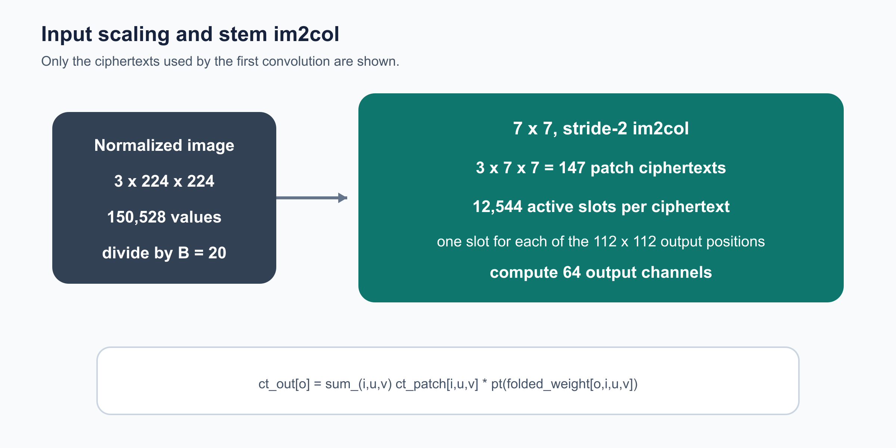
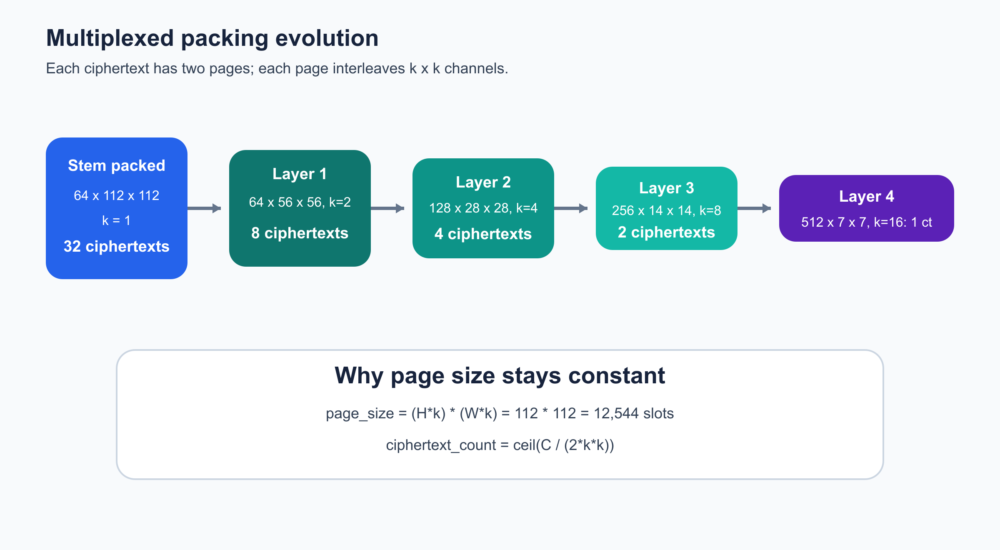
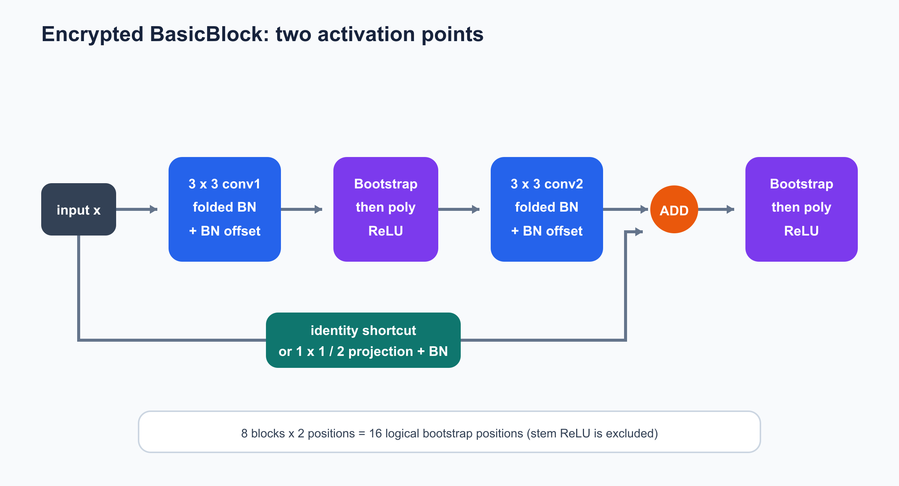
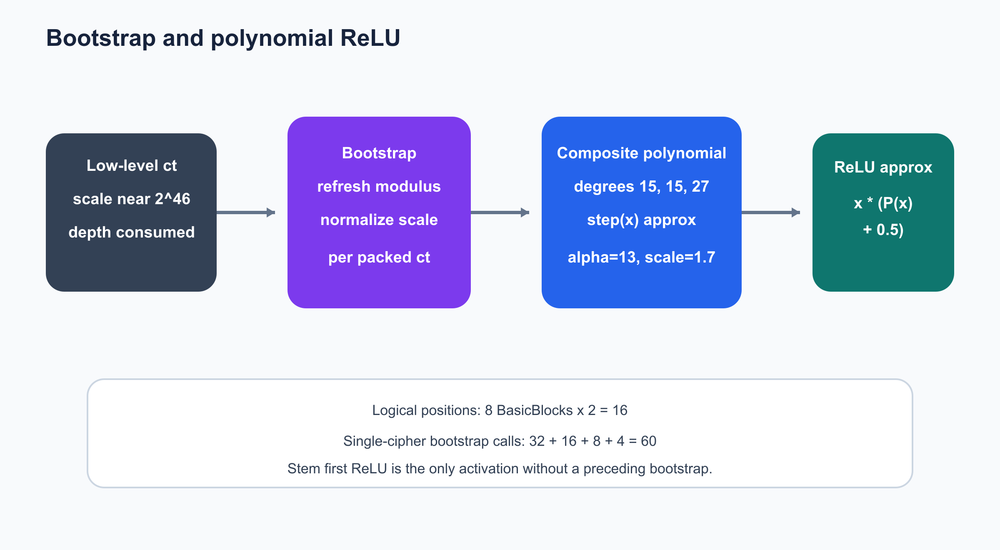
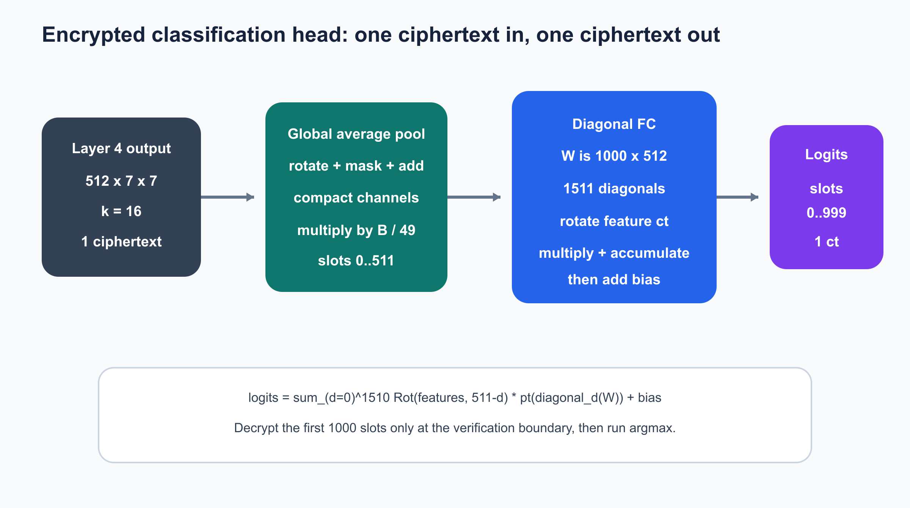

# ResNet-18 密态推理 Benchmark

### ResNet-18

本文说明 `Trident/resnet18` 如何使用 Poseidon CKKS 完成 ImageNet ResNet-18密态推理。输入是一张 `3 x 224 x 224` 图片，输出为 1000 个 ImageNet
类别 logits。

当前实现采用 BasicBlock 版 ResNet-18。标准 max-pool 需要比较操作，CKKS不能直接完成，因此 stem 使用同样尺寸的 `3 x 3`、stride-2 average-pool。
网络结构如下。


| 网络部分 | Block 数 | 输出形状 |
| --- | ---: | ---: |
| Stem：`7 x 7` 卷积 | 1 | `64 x 112 x 112` |
| Stem：`3 x 3` 平均池化 | - | `64 x 56 x 56` |
| Layer 1 | 2 | `64 x 56 x 56` |
| Layer 2 | 2 | `128 x 28 x 28` |
| Layer 3 | 2 | `256 x 14 x 14` |
| Layer 4 | 2 | `512 x 7 x 7` |
| 全局平均池化 + FC | - | 1000 logits |

一个 BasicBlock 的明文逻辑为：

```text
y = ReLU(F(x; W) + S(x))

F: 3x3 conv -> BN -> ReLU -> 3x3 conv -> BN
S: identity，或 1x1 stride-2 projection -> BN
```

模型权重作为 CKKS 明文参与运算；输入与中间激活保持为密文。当前程序还会在同一进程中持有私钥并解密中间结果，用于逐层正确性检查，所以它是研究与
验证原型，不是 evaluator-only 的生产部署。

### CKKS 与多项式 ReLU

CKKS 支持近似 SIMD 加法、乘法和 rotation，但不直接支持比较。代码用三段复合多项式近似阶跃函数，再计算 ReLU：

```text
ReLU(x) ~= x * (P3(P2(P1(x))) + 0.5)
degree(P1, P2, P3) = (15, 15, 27)
```

当前参数如下。

| 参数 | 当前值 |
| --- | ---: |
| 多项式模数次数 | `N = 2^16` |
| CKKS slots | `2^15 = 32768` |
| 默认 scale | 约 `2^40` |
| Bootstrap EvalMod scale | 约 `2^45` |
| Q 链 | `1 x 45-bit + 20 x 40-bit + 14 x 45-bit`（35 primes / 1475 bit） |
| 特殊模数 P | 默认 `12 x 51-bit` |
| dnum | 默认 `3`，可选 `4` |
| 输入/激活边界 | `B = 20` |
| 逻辑 bootstrap 位置 | 16 |
| 当前 packing 下单密文 bootstrap 调用 | 60 |

## 实现过程

密态数据流依次为：

```text
预处理与缩放
-> 输入加密与 stem im2col
-> multiplexed packing
-> 8 个密态 BasicBlock
-> 全局平均池化
-> BSGS 对角线矩阵法 FC
-> 解密 logits 与 argmax
```

### 步骤 1：输入加密与 Stem

每个 ImageNet 样本按 CHW 顺序包含：

```text
3 x 224 x 224 = 150528 values
```

输入首先除以全局边界 `B = 20`，随后直接为首层卷积构造 im2col 布局。对于 3 个输入通道和 `7 x 7` 核，一共加密 147 个 patch 密文；每个密文的 12544 个有效 slots对应 `112 x 112` 个输出空间位置。



```text
stem patch ciphertexts = 3 x 7 x 7 = 147
active slots / ciphertext = 112 x 112 = 12544

ct_out[o]  = sum_(i,u,v) ct_patch[i,u,v] * pt(folded_weight[o,i,u,v])
```

卷积权重中已经融合 BatchNorm 的乘法部分：

```text
folded_weight[o,i,u,v]
  = weight[o,i,u,v] * gamma[o] / sqrt(var[o] + epsilon)
```

BN 的偏移项之后通过 `add_plain` 加入。对应代码入口为：

```cpp
Im2ColCipherGroup conv1_im2col = encrypt_conv2d_im2col_patches(
    image_values, 224, 224, 3, 2, 7, 7,
    runtime, plan.log_scale);

ChannelCipherGroup encrypted_stem =
    encrypted_conv2d_im2col_all_channels(
        conv1_im2col, 64, weights.conv_weight[0],
        weights.bn_running_var[0], weights.bn_weight[0],
        kBatchNormEpsilon, runtime);
```

### 步骤 2：Multiplexed 密文布局

首层卷积先得到 64 个“每通道一个密文”的输出，随后转换为 multiplexed布局。每个密文包含两个 page，每个 page 交织 `k x k` 个逻辑通道。

```text
channels_per_page       = k * k
channels_per_ciphertext = 2 * k * k
page_size               = (H * k) * (W * k)
ciphertext_count        = ceil(C / (2 * k * k))
```

每次 stride-2 将 `H`、`W` 减半，同时把 `k` 加倍。因此整个网络保持：

```text
H * k = W * k = 112
page_size = 112 * 112 = 12544 slots
```



| 位置 | 逻辑形状 `C x H x W` | `k` | 每密文最多通道数 | 密文数 |
| --- | ---: | ---: | ---: | ---: |
| Stem packed | `64 x 112 x 112` | 1 | 2 | 32 |
| Stem avgpool / Layer 1 | `64 x 56 x 56` | 2 | 8 | 8 |
| Layer 2 | `128 x 28 x 28` | 4 | 32 | 4 |
| Layer 3 | `256 x 14 x 14` | 8 | 128 | 2 |
| Layer 4 | `512 x 7 x 7` | 16 | 512 | 1 |

这里的“逻辑张量”可能由多个 packed 密文共同表示。后文的逻辑 bootstrap 位置是网络图中的位置，而实际 bootstrap 调用次数还要乘以该位置的密文数。

### 步骤 3：密态 BasicBlock

ResNet-18 共有 8 个 BasicBlock，每个 block 有两个 `3 x 3` 卷积和两个激活点。



主分支执行：

```text
3x3 conv1 + folded BN scale
-> BN offset
-> bootstrap
-> polynomial ReLU
-> 3x3 conv2 + folded BN scale
-> BN offset
```

随后主分支与 shortcut 对齐模数层级并相加，再执行第二次`bootstrap -> polynomial ReLU`。Layer 1 使用 identity shortcut；Layer 2、3、4 的首个 block 使用 `1 x 1`、stride-2 projection shortcut。密态残差加法会先把两侧降到相同 `parms_id`：

```cpp
if (lhs_chain > rhs_chain) {
    evaluator.drop_modulus(lhs_cipher, lhs_cipher, rhs_cipher.parms_id());
} else if (rhs_chain > lhs_chain) {
    evaluator.drop_modulus(rhs_cipher, rhs_cipher, lhs_cipher.parms_id());
}
evaluator.add_dynamic(lhs_cipher, rhs_cipher, output, encoder);
```

### 步骤 4：Multiplexed 密态卷积

主体卷积不是解包后逐通道计算，而是在 packed ciphertext 上完成 rotation、明文乘法、mask 和累加。


```text
ct_out[o,r,c]
  = sum_(i,u,v)
      Rot(ct_in[i], delta[u,v])
      * pt(folded_weight[o,i,u,v])
```

执行含义为：

1. rotation 把卷积核所需的相邻位置和输入通道贡献对齐；
2. 先将同一输出通道的 kernel 乘积以及所有输入 pack 贡献保持在同一高 scale 下累加；
3. 跨 input-pack 累加完成后统一 rescale，再执行一次包含 BN scale 的输出选择和第二次 rescale；
4. 同 level/scale 的累加通过 `add(lhs, rhs, lhs)` 原地完成，避免反复分配中间密文；
5. 把结果放入目标输出 pack；stride-2 时同时把 `k` 更新为 `2k`。

compact 路径不改变每层两级乘法深度，但把固定网络的 multiplexed 卷积 rescale 上界
从原始103424次降到9472次；默认融合BSGS再把Layer3/4的7680次替换为35个
pack-matrix rescale，使当前默认上界为1827次。

每个 kernel 项通过 Poseidon CPU evaluator 的融合 PMult-Accumulate 直接加入 RNS
accumulator，避免完整临时密文。Stem 的147个 im2col常数项同样先融合累加再统一
rescale，使Stem的理论 rescale 数由9408降为64；常数权重使用专用 residue 快路径，
不再逐项构造通用 CKKS 明文。

compact路径先跨全部input packs累加，再统一做局部通道归约和输出位置旋转，
Layer1/2因此默认使用compact。Layer3/4的stride-2主分支3×3及projection 1×1、
Layer3/4的3个stride-1卷积默认进一步把空间位移、通道矩阵和BN乘法缩放融合成
稀疏对角BSGS。同一个input pack和n1下的多个输出矩阵共享baby rotations：

| 路径（单层） | BSGS对角/PMult | sharing前rotation | sharing后rotation |
| --- | ---: | ---: | ---: |
| Layer2 stride-2 3×3 / projection（可选） | 7776 / 2400 | 1760 / 928 | 1352 / 712 |
| Layer3 stride-2 3×3 / projection | 8664 / 2904 | 912 / 544 | 788 / 460 |
| Layer4 stride-2 3×3 / projection | 9126 / 3174 | 462 / 264 | 462 / 264 |
| Layer3 stride-1 3×3 | 11532 | 672 | 610 |
| Layer4 stride-1 3×3 | 11907 | 294 | 294 |

新路径针对单线程中更昂贵的rotation/key-switch换取额外PMult，并让同源baby rotations
由所有对角线复用。每个input/output pack矩阵各rescale一次，但整层都处于同一个输出
level，所以乘法深度从2降为1。对角明文到达该层时编码，准备时间与实际字节数会写入
日志，且不计入`encrypted_inference_time_ms`。默认在该层结束后释放计划，避免全网
10万余条大明文累计常驻；`RESNET18_FUSED_BSGS_CACHE_MB`可设置跨图片LRU缓存上限。用
`RESNET18_FUSED_CONV_BSGS=0`可关闭全部新路径；也可以通过
`RESNET18_TRANSITION_BSGS`、`RESNET18_LAYER3_BSGS`和`RESNET18_LAYER4_BSGS`
分别A/B测试。Layer2 transition默认保留compact，可用
`RESNET18_LAYER2_TRANSITION_BSGS=1`仅做同机A/B。标准Winograd没有启用：在当前packing下，直接3×3只有9个空间分量，
`F(2×2,3×3)`反而需要16个变换域分量及额外输入/输出变换。

### 步骤 5：Bootstrap 与 ReLU

乘法和 rescale 会逐步消耗 Q 链。除 stem 的第一个 ReLU 外，每个激活点之前都进行 bootstrap，恢复后续多项式所需的层级，并把 scale 归一化到约 `2^40`。
中间激活默认把Bootstrap输出从`chain_index=20`直接drop到16，再执行恰好消耗
14 level的复合ReLU，输出位于2，减少多项式在高层Q前缀上的RNS/NTT工作。
最终Layer4输出保留完整Bootstrap层级供分类头使用；`RESNET18_POST_BOOTSTRAP_LEVEL=20`
可回退旧行为。



```cpp
Ciphertext result = cnn_in.cipher();
evaluator.bootstrap(result, result, relin_keys, galois_keys,
                    encoder, bootstrap_config);
normalize_bootstrap_output_scale(result, bootstrap_context);
```

#### 为什么是 16 个逻辑位置、60 次实际调用

每个 BasicBlock 有两个需要 bootstrap 的激活点：

```text
8 blocks x 2 activation points = 16 logical positions
```

但 bootstrap 的输入是 packed ciphertext，而不是抽象的整层张量：

| Stage | Block 数 | 每 block 激活点 | 每个位置的密文数 | 单密文调用数 |
| --- | ---: | ---: | ---: | ---: |
| Layer 1 | 2 | 2 | 8 | 32 |
| Layer 2 | 2 | 2 | 4 | 16 |
| Layer 3 | 2 | 2 | 2 | 8 |
| Layer 4 | 2 | 2 | 1 | 4 |
| 合计 | 8 | 16 个逻辑位置 | - | **60** |

因此，“逻辑 bootstrap 位置 16”描述网络计算图，“单密文 bootstrap 60 次”描述当前 packing 下 evaluator 实际执行的次数。

### 步骤 6：密态分类头

Layer 4 输出 `512 x 7 x 7`，已经完整装在一个密文中。全局平均池化先按列rotation-add，再按行 rotation-add，然后把 512 个通道基准位置压紧到slots `0..511`。

```text
pooled[c] = (B / 49) * sum_(r=0..6,c=0..6) feature[c,r,c]
```

其中 `B / 49 = 20 / 49` 同时完成空间平均并恢复此前的边界缩放。



FC 权重形状为 `1000 x 512`。代码不为每个类别生成一个密文，而是使用 1511 条矩阵对角线和 BSGS，把 1000 个 logits 写进同一个输出密文的前 1000 个 slots。当前形状自动选择 `baby_step=32`：先缓存 32 个 baby-step 密文，再把对角线组成 48 个 giant groups，按 `RESNET18_THREADS` 分块并行。

```text
logits
  = sum_g Rot(
      sum_b Rot(features, b) * pt(Rot(diagonal_(g+b)(W), -g)),
      g)
    + bias
```

这使非零密文 rotation 从 1510 次降为 78 次（31 次 baby、47 次 giant），并将
逐对角线的 1511 次 rescale 合并为最终 1 次；明文乘法仍为 1511 次。

实现入口：

```cpp
matrix_multiplication(
    encrypted_head_pooled, encrypted_head_logits,
    weights.linear_weight, weights.linear_bias,
    kImageNetClassCount, kResNet18FinalChannels,
    *runtime.evaluator, runtime.galois_keys, runtime.encoder);
```

最终仅在验证边界解密前 1000 个 slots，并执行 `argmax`。

## 源代码

| 文件 | 作用 |
| --- | --- |
| `infer.cpp` | 端到端密态推理、布局转换、8 个 BasicBlock 和日志 |
| `infer_config.*` | 网络常量、CKKS 模数链和 ReLU 参数 |
| `infer_runtime.*` | Poseidon context、encoder、evaluator 和密钥 |
| `encrypted_group_ops.*` | Stem im2col 与首层卷积 |
| `encrypted_ops.*` | 单密文 bootstrap 和 BSGS 对角线矩阵乘 |
| `relu_approx.*` | 复合多项式 ReLU |
| `parameter_loader.*` | torchvision 参数和 ImageNet 输入加载 |
| `plain_cnn.*` | 同步的明文参考计算 |
| `progress_log.*` | 算子耗时、level、scale 和误差日志 |

密态主入口：

```cpp
void ResNet_imagenet_sparse(
    std::size_t start_image_id,
    std::size_t end_image_id);
```

## 编译与运行

在 Poseidon 仓库根目录完成依赖编译后，配置 Trident：

```bash
cmake -S Trident -B Trident/build \
  -DCMAKE_BUILD_TYPE=Release \
  -DRESNET18=ON

cmake --build Trident/build --target resnet18 resnet18_plain -j4
RESNET18_THREADS=4 \
./Trident/build/resnet18/resnet18 0 0
```

`RESNET18_THREADS` 同时控制不同密文 pack 之间的 Bootstrap、ReLU、布局操作，以及
卷积和全连接的并行度。卷积在 pack 数足够时按输出 pack 并行；Layer 3/4 的 pack
较少时自动切换为单 pack 内输出通道并行。全连接按 BSGS giant groups 分块并行。
Bootstrap 并行会显著增加峰值内存，建议从 2 或 4 个线程开始测试；内存充足时再试 8。

输出日志位于：

```text
Trident/resnet18/result/
```
