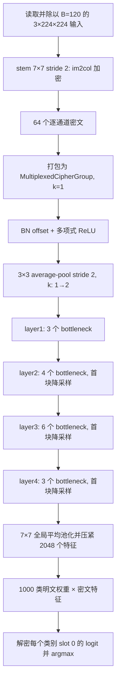

# ResNet-50 密态推理实现详解

本文说明 `Trident/resnet50` 中当前代码如何使用 Poseidon CKKS 实现 ResNet-50 ImageNet 密态推理。重点是代码中的真实数据布局、同态算子、模数链管理和执行顺序，而不是一般性的 ResNet-50 网络介绍。

> 说明：本文描述的是当前实现。当前程序会为逐层正确性检查解密中间密文，因此它是研究和调试用的端到端原型，不是 evaluator-only 的生产部署。完整同态模式中的卷积、BN、ReLU、残差、池化和 FC 均按密文路径执行，但诊断逻辑仍持有并使用私钥。

## 1. 实现目标与总体思路

CKKS 支持近似实数的 SIMD 运算，但不直接支持比较，因此普通 ReLU 和 max-pool 不能直接执行。当前实现采用以下策略：

1. 输入和所有中间激活除以统一边界 `B = 120`，让数值保持在多项式 ReLU 的工作范围附近。
2. 卷积权重和 BN 的乘法项融合，减少一次独立密文乘法。
3. 激活张量采用 multiplexed packing，把多个通道和空间位置交织到 CKKS slots 中。
4. ReLU 使用复合 Chebyshev 多项式近似。
5. 每个 bottleneck 的三个激活点之前执行 bootstrap，恢复可用模数层级。
6. stem 的标准 max-pool 被当前实现替换为 `3×3, stride=2, padding=1` 的 average-pool。
7. 全局平均池化后，把 2048 个通道压紧到一个密文的前 2048 个 slots，再执行 1000 类全连接。
8. 同步执行一条明文参考路径，并在几乎每个算子后解密比较误差。

整体流程如下：



## 2. 代码文件分工

| 文件 | 作用 |
| --- | --- |
| `resnet50.cpp` | 解析图片起止 ID，调用密态推理入口 |
| `infer.cpp` | 组织完整网络、bottleneck、明文参考和误差日志 |
| `infer_config.*` | 网络常量、CKKS 参数、模数链和 ReLU 配置 |
| `infer_runtime.*` | 创建 Poseidon context、encoder/evaluator 和各种密钥 |
| `parameter_loader.*` | 读取图片、标签和 torchvision 导出的模型参数 |
| `encrypted_group_ops.*` | stem 的 im2col 加密及首个 `7×7` 卷积 |
| `multiplexed_ops.*` | multiplexed packing、卷积、BN、bootstrap、ReLU、池化和 FC |
| `tensor_cipher.*` | 把一个密文和逻辑张量元数据封装后交给 ReLU/bootstrap |
| `encrypted_ops.*` | 单个 packed ciphertext 的多项式 ReLU 和 bootstrap 包装 |
| `relu_approx.*` | 多项式系数加载、Chebyshev 求值树和明/密文近似函数 |
| `plain_cnn.*` | 与密文路径同步的明文参考算子 |
| `progress_log.*` | 算子耗时、内存、chain index 和执行进度日志 |
| `parallel_utils.h` | 按 pack、输出通道或类别并行执行 |

## 3. 网络结构与张量形状

当前网络采用 ResNet-50 bottleneck 结构，四个 stage 的 block 数分别为：

```text
layer1: 3 blocks
layer2: 4 blocks
layer3: 6 blocks
layer4: 3 blocks
```

每个 bottleneck 的主分支为：

```text
1×1 conv, planes channels
→ BN
→ bootstrap
→ polynomial ReLU
→ 3×3 conv, planes channels
→ BN
→ bootstrap
→ polynomial ReLU
→ 1×1 conv, 4×planes channels
→ BN
→ residual add
→ bootstrap
→ polynomial ReLU
```

各 stage 的 `planes` 和输出通道数为：

| Stage | Blocks | planes | 输出通道 | 空间尺寸 |
| --- | ---: | ---: | ---: | ---: |
| stem conv | 1 | 64 | 64 | `112×112` |
| stem avgpool | - | 64 | 64 | `56×56` |
| layer1 | 3 | 64 | 256 | `56×56` |
| layer2 | 4 | 128 | 512 | `28×28` |
| layer3 | 6 | 256 | 1024 | `14×14` |
| layer4 | 3 | 512 | 2048 | `7×7` |
| head | - | - | 1000 logits | `1×1` |

`layer2`、`layer3`、`layer4` 的第一个 block 在主分支 `3×3 conv` 和 shortcut `1×1 conv` 上使用 stride 2。每个 stage 的第一个 block 都使用 projection shortcut，因为 layer1 也需要把 64 通道扩展到 256 通道。

按 ResNet 的常见计数方式，stem 1 个卷积、16 个 bottleneck 中的 48 个卷积以及最后 FC 合计为 50 层；projection shortcut 不计入这个数字。

## 4. 数值缩放与 BN 融合

### 4.1 统一边界缩放

输入加载函数将每个输入值除以：

```text
B = kResNet50Boundary = 120
```

设原始域中的激活为 `x`，密文中保存的是：

```text
x_scaled = x / B
```

由于 ReLU 满足正齐次性，`ReLU(x/B) = ReLU(x)/B`，因此网络可以在缩放域中持续计算。最后全局平均池化乘回 `B`，再进入原始 torchvision FC 权重。

### 4.2 卷积与 BN 乘法项融合

普通 BN 为：

```text
BN(z) = gamma × (z - mean) / sqrt(var + epsilon) + beta
```

卷积阶段先把每个输出通道的乘法项融合到卷积结果：

```text
folded_scale = gamma / sqrt(var + epsilon)
conv_scaled = Conv(x_scaled, W) × folded_scale
```

随后 BN 算子只需要给该通道所有有效 slots 加一个明文 offset：

```text
offset = (beta - mean × gamma / sqrt(var + epsilon)) / B
output = conv_scaled + offset
```

这样得到的结果正好是 `BN(Conv(x, W)) / B`。BN offset 使用 `add_plain`，不消耗乘法深度。

## 5. CKKS 参数、密钥与模数链

默认参数由 `default_poseidon_plan()` 和 `make_poseidon_runtime()` 创建：

| 参数 | 当前值 | 含义 |
| --- | ---: | --- |
| `logN` | 16 | 多项式环维度 `N = 2^16` |
| slot 数 | 32768 | CKKS 复数 slots 数 `N/2` |
| `log_scale` | 46 | 默认 scale 为约 `2^46` |
| `boot_level` | 14 | bootstrap 预留 14 个层级 |
| `q0` | 51 bit | bootstrap 要求的底部单素数 |
| 特殊模数 P | 51 bit | key switching 使用 |

当前 Q 链由以下部分组成：

```text
1 × 51-bit q0
20 × 46-bit primes
14 × 51-bit bootstrap primes
```

`validate_bootstrap_modulus_chain()` 会在启动时检查：

- q0 必须是 51 bit。
- q0 上方第一个素数必须匹配 46-bit scale。
- 模数链尾部必须恰好预留 14 个 51-bit bootstrap primes。

运行时一次性生成并持有：

- public key 和 secret key；
- relinearization keys；
- Galois rotation keys；
- `CKKSEncoder`、`Encryptor`、`Decryptor`、`EvaluatorCkksBase`；
- bootstrap 配置。

当前 factory 使用 `DEVICE_SOFTWARE`，即软件执行路径。

## 6. 三种密文布局

### 6.1 `Im2ColCipherGroup`

只用于 stem 首个 `7×7, stride=2` 卷积。对于输入 `3×224×224`：

- 输出空间大小为 `112×112 = 12544`；
- 每个 `(input_channel, kernel_row, kernel_col)` 生成一个密文；
- 总密文数为 `3 × 7 × 7 = 147`；
- 每个密文的前 12544 个 slots 保存该 kernel offset 对应的 im2col patch。

这使首层每个输出通道可以直接对 147 个密文做明文标量乘法并累加，避免把完整输入塞进单个 CKKS ciphertext。

### 6.2 `ChannelCipherGroup`

stem 卷积完成后得到 64 个输出通道，每个通道一个密文：

```text
64 ciphertexts × 12544 active slots
```

该布局只作为首层卷积输出和后续 multiplexed packing 的过渡格式。

### 6.3 `MultiplexedCipherGroup`

网络主体使用：

```cpp
struct MultiplexedCipherGroup {
    int h, w, c;
    int k;
    int pages_per_cipher = 2;
    size_t page_size;
    size_t slot_count;
    vector<Ciphertext> packs;
};
```

`k` 控制空间交织密度：

```text
每页可容纳通道数 = k²
page_size = (H × k) × (W × k)
每个 ciphertext 固定放 2 页
每个 ciphertext 可容纳通道数 = 2k²
ciphertext 数 = ceil(C / (2k²))
```

令全局通道号为 `ch`，局部通道在一页中的编号为 `lc`，页内行列偏移为：

```text
row_offset = floor(lc / k)
col_offset = lc mod k
```

逻辑位置 `(ch, row, col)` 对应 slot：

```text
slot = local_page × page_size
     + (row × k + row_offset) × (W × k)
     + (col × k + col_offset)
```

### 6.4 为什么降采样时令 `k` 加倍

stride 2 卷积或 stem pool 会让 `H、W` 各减半，同时代码令 `k_out = 2 × k_in`。因此 `H×k` 和 `W×k` 保持不变，page size 始终为：

```text
112 × 112 = 12544 slots
```

每个密文使用两页，即最多 25088 个 active slots，小于 CKKS 的 32768 slots。

| 位置 | H×W | C | k | 每页通道 | 每密文通道 | 密文数 |
| --- | ---: | ---: | ---: | ---: | ---: | ---: |
| stem packed | `112×112` | 64 | 1 | 1 | 2 | 32 |
| stem avgpool | `56×56` | 64 | 2 | 4 | 8 | 8 |
| layer1 输出 | `56×56` | 256 | 2 | 4 | 8 | 32 |
| layer2 输出 | `28×28` | 512 | 4 | 16 | 32 | 16 |
| layer3 输出 | `14×14` | 1024 | 8 | 64 | 128 | 8 |
| layer4 输出 | `7×7` | 2048 | 16 | 256 | 512 | 4 |

## 7. Stem 的实现

### 7.1 输入读取

`read_plain_image_values()` 从 `test_values.txt` 读取一张 CHW 展平的 `3×224×224` 图片，并逐值除以 `B=120`。

### 7.2 im2col 加密

`encrypt_conv2d_im2col_patches()` 对每个输入通道和每个 `7×7` kernel offset 构造一个 slot vector。第 `(oh, ow)` 个 slot 保存：

```text
input[ic, oh×2 + kh - 3, ow×2 + kw - 3]
```

越界位置保持为 0，从而实现 padding。每个 slot vector 使用 `2^46` scale 编码并加密。

### 7.3 首层卷积

`encrypted_conv2d_im2col_all_channels()` 为每个输出通道并行执行：

1. 遍历 147 个 patch ciphertext。
2. 取对应卷积权重。
3. 把 BN 的 `gamma/sqrt(var+epsilon)` 融入系数。
4. 执行 ciphertext × plaintext scalar。
5. rescale 回输入 scale。
6. 用 `add_dynamic` 累加所有项。

最终产生 64 个 `112×112` 通道密文。

### 7.4 转换为 multiplexed 布局

`pack_channel_group_as_multiplexed_k1()` 用 mask、rotation 和 add 把两个通道放入同一个 ciphertext 的两页中，将 64 个密文压缩为 32 个 packed ciphertext。之后网络主体不再使用逐通道布局。

stem BN 只加 offset，随后执行第一次多项式 ReLU。第一次 ReLU 前不做 bootstrap，因为新加密密文仍有足够层级。

最后执行 `3×3, stride=2, padding=1` average-pool，并乘以 `1/9`。该操作同时把布局从 `k=1` 转为 `k=2`。

> 当前密态模型的 stem 是 average-pool，不是 torchvision 标准 ResNet-50 的 max-pool。明文对照必须使用同样的 `avgpool` 配置。

## 8. Multiplexed 卷积

`multiplexed_channel_conv2d_all_channels()` 同时支持 `1×1`、`3×3` 和 stride 1/2。核心步骤如下。

### 8.1 空间旋转

对 kernel 位置 `(kh, kw)`，旋转步长为：

```text
step = k² × W × (kh - pad_h) + k × (kw - pad_w)
```

旋转把对应邻域位置移动到当前输出位置。边界位置通过 plaintext weight vector 中的 0 掩掉，避免环形 rotation 造成错误的 padding 回卷。

### 8.2 紧凑权重向量

针对一个 input pack 和一个 output channel，代码构造与 slots 等长的 plaintext vector：

- 每个有效输入通道位置写入对应卷积权重；
- padding 或该 pack 不包含的通道写 0；
- 编码 scale 根据当前层最后一个 modulus prime 自动选择；
- 执行 ciphertext × plaintext vector 后 rescale。

### 8.3 通道归约和重排

乘法后，同一 output channel 的贡献分散在 `k×k` 交织位置和两页中。`rotate_multiplexed_local_channel_sum_to_base()` 通过以下 rotation-add 完成归约：

1. 沿页内列偏移做 `log2(k)` 次旋转相加。
2. 沿页内行偏移做 `log2(k)` 次旋转相加。
3. 把第二页旋转到第一页并相加。

然后根据目标 output channel 的页、行偏移和列偏移旋转到目标位置，再乘选择向量。选择向量同时融合该输出通道的 BN 乘法项：

```text
gamma / sqrt(running_var + epsilon)
```

最后累加所有 input packs 和 output channels，得到新的 `MultiplexedCipherGroup`。

### 8.4 stride 2

stride 2 时：

```text
H_out = H_in / 2
W_out = W_in / 2
k_out = 2 × k_in
```

因此输出仍使用相同 page size，而单位 ciphertext 能容纳更多通道。

## 9. BN、残差和 stem average-pool

### 9.1 Batch normalization

卷积已经融合 BN 乘法项，因此 `multiplexed_channel_batch_norm()` 只构造逐通道 offset vector 并执行一次 `add_plain`。它不改变布局、scale 或 chain index。

### 9.2 Residual add

`multiplexed_channel_add()` 首先检查两个分支的 `H/W/C/k/page_size/pack count` 完全一致。如果 chain index 不同，较高的一方先 drop modulus 到较低一方的 `parms_id`，再使用 `add_dynamic` 对齐 scale 后相加。

block 0 使用 `1×1` projection shortcut；其余 block 直接复用输入 packed ciphertext。

### 9.3 Average-pool

stem average-pool 对每个 output pack：

1. 为 `3×3` 九个 kernel offset 分别旋转输入。
2. 使用 mask 只保留有效输出 slots。
3. 累加九个位置。
4. 明文乘 `1/9` 并 rescale。
5. 把 `k` 加倍，保持 page size 不变。

padding 区域按 0 参与固定分母 9 的平均。

## 10. 多项式 ReLU

CKKS 无法直接比较 `x` 与 0。当前代码近似阶跃函数，再计算：

```text
ReLU(x) ≈ x × StepApprox(x)
```

默认配置为：

```text
component degrees = [15, 15, 27]
alpha = 13
scaled_val = 1.7
evaluation tree = OddBaby
coefficient file = relu_param/d13.txt
```

`approximate_sign()` 按顺序复合三个 Chebyshev 多项式分量，然后加 `0.5`，得到近似阶跃 mask：

```text
mask = P3(P2(P1(x))) + 0.5
```

`relu()` 再执行：

1. `x × mask` 的 ciphertext-ciphertext multiply。
2. 使用 relinearization key 降低密文尺寸。
3. rescale 一层。
4. 把输出 scale 校准回目标 `2^46`。

明文参考路径调用同一组系数和同样的复合顺序，因此逐层比较的是“密文多项式 ReLU”和“明文多项式 ReLU”，不是直接和标准 `max(0,x)` 比较。

在非 mock 模式下，ReLU 前会先丢弃仍位于链尾的 51-bit bootstrap primes，直到下一层是 46-bit prime，使多项式求值回到预期 scale 链。

## 11. Bootstrap 策略

每个 bottleneck 有三个 bootstrap 位置：

- `conv1 → BN` 之后、ReLU1 之前；
- `conv2 → BN` 之后、ReLU2 之前；
- `conv3 → BN → residual add` 之后、ReLU3 之前。

16 个 bottleneck 因此共有 48 个逻辑 bootstrap 位置。每个位置会对该层所有 packed ciphertext 分别 bootstrap；按当前布局合计约 351 次单 ciphertext bootstrap。stem 的第一次 ReLU 不 bootstrap。

`bootstrap_tensor()` 的处理为：

1. 把 pack ciphertext 连同逻辑 `k/h/w/c/pages` 元数据包装为 `TensorCipher`。
2. 调用 Poseidon `evaluator.bootstrap()`。
3. 检查 bootstrap 输出 scale。
4. 如 scale 不等于目标值，明文乘校准因子并 rescale。
5. 强制记录为目标 scale。

校准因子为：

```text
plain_scale = target_scale × q_last / current_scale
```

当前诊断代码会在 bootstrap 前后都解密一次，并记录 `before_vs_after` 最大绝对误差。

## 12. Bottleneck 的完整执行顺序

`traced_bottleneck_block()` 同时维护明文张量和密文 packed group。一个 block 的实际顺序为：

```text
main branch:
  conv1(fold BN scale) → add BN offset → bootstrap → poly ReLU
  conv2(fold BN scale) → add BN offset → bootstrap → poly ReLU
  conv3(fold BN scale) → add BN offset

shortcut:
  block 0: projection conv(fold BN scale) → add BN offset
  other: identity

merge:
  align modulus/scale → add → bootstrap → poly ReLU
```

每一步之后都调用 `log_multiplexed_compare()`：解密当前 packed group、恢复为 CHW 顺序，并和同步明文结果计算误差。

## 13. Head：全局平均池化和全连接

### 13.1 全局平均池化

layer4 输出为 `2048×7×7`，位于 4 个 packed ciphertext 中。`multiplexed_global_average_pool_packed()` 分三步执行：

1. **列求和**：对每一列旋转，并用 column mask 把结果保留在每个通道的第 0 列。
2. **行求和**：继续按行旋转，并用 channel-base mask 把每个通道空间和保留在 `(row=0,col=0)`。
3. **通道压紧**：逐通道把各自的 base slot 旋转到目标 slot `channel`，最终得到一个 ciphertext，其前 2048 个 slots 对应 2048 个通道。

最后乘：

```text
B / (H × W) = 120 / 49
```

这既完成平均，也把前面一直保存的 `/B` 缩放恢复到原始特征尺度。

### 13.2 全连接

输入 ciphertext 的前 2048 个 slots 保存特征。对 1000 个类别分别并行执行：

1. 把该类别的 2048 个 FC 权重编码到 plaintext vector 前 2048 个 slots。
2. ciphertext × plaintext vector，并 rescale。
3. 按 `1, 2, 4, ..., 1024` 旋转相加，把 2048 项归约到 slot 0。
4. 在 slot 0 加该类别 bias。

输出为 1000 个 ciphertext，每个 ciphertext 的 slot 0 保存一个类别 logit。程序逐个解密 slot 0，组成 1000 维 logit vector 并执行 argmax。

模型权重始终是明文 plaintext multiplier，因此当前实现保护输入和中间激活，不保护模型参数。

## 14. Scale、level 和旋转管理

### 14.1 明文乘法与 rescale

plaintext scale 根据当前 ciphertext 所在层最后一个 modulus prime 选择。乘法后调用 `rescale_dynamic(..., input.scale())`，尽量把结果恢复到输入 scale。

非常小、按当前 plaintext scale 编码后会量化为 0 的系数会被跳过，以避免无效乘法。

### 14.2 动态加法

普通累加使用 `add_dynamic`，由 evaluator 处理 scale 和参数对齐。残差分支还显式比较 chain index，并先把层级较高的密文 drop 到较低分支。

### 14.3 Rotation

代码把任意 rotation step 分解为 2 的幂：

```text
step = b0×1 + b1×2 + b2×4 + ...
```

然后依次使用 Galois keys 旋转。卷积、packing、池化、通道压紧和 FC 归约都复用该逻辑。

## 15. 明文参考与误差验证

当前推理不是只在最终输出解密，而是维护一条同步明文路径：

- 输入、卷积、BN、ReLU、残差、池化和 FC 均有对应明文计算。
- 每个密文算子后解密 packed ciphertext。
- 按 slot mapping 恢复 CHW 数组。
- 记录 `max_abs_error`、`mean_abs_error`、最大虚部、明文/密文最大绝对值。
- 最终比较 plain prediction 和 encrypted prediction。

主要日志字段：

| 字段 | 含义 |
| --- | --- |
| `[cipher-state]` | shape、k、pack 数、chain index 和 scale |
| `[compare]` | 当前层明/密文误差 |
| `[value-dump]` | 前若干个明文、密文实部和虚部 |
| `bootstrap self max_abs_error` | bootstrap 前后自身误差 |
| `[head-chain]` | head 各步骤的剩余 level |
| `[logit-decision]` | 标签、明文预测、密文预测和是否一致 |
| `[operation]` | 算子耗时和内存变化 |
| `image_done` / `run_done` | 图片和整次任务完成标记 |

这些检查非常适合定位第一个误差突增的层，但会显著增加时间和内存开销。

## 16. Mock 模式的实现

`RESNET50_MOCK_RELU=1` 时：

1. 解密 ReLU 输入。
2. 在 CPU 上执行同一个多项式 ReLU。
3. 按原 multiplexed slot mapping 重新编码并加密。

`RESNET50_MOCK_BOOTSTRAP=1` 时：

1. 解密 bootstrap 输入。
2. 不改变数值。
3. 重新编码和加密，以模拟刷新后的新密文。

重新加密后会丢弃尾部 51-bit primes，使 chain 布局与后续真实 ReLU 路径兼容。Mock 模式用于隔离问题：

- mock 正确、完整模式错误：优先检查 bootstrap/ReLU 和 scale。
- 两种模式都错误：优先检查 packing、rotation、mask、权重索引或 BN 融合。

Mock 模式不代表真实同态安全性、误差或性能。

## 17. 并行与性能特征

`RESNET50_THREADS` 控制并行度，未设置时最多使用 8 个硬件线程。并行粒度包括：

- stem 的 64 个输出通道；
- multiplexed convolution 的 output packs；
- BN、bootstrap、ReLU 和 pool 的 packs；
- FC 的 1000 个类别。

主要性能开销来自：

1. 48 个逻辑 bootstrap 点及其数百次单 pack bootstrap。
2. 卷积中大量 rotation、plaintext-vector multiply 和 rescale。
3. 逐层解密、decode 和明文对照。
4. FC 为每个类别生成一个独立 ciphertext。
5. Galois/relinearization keys 和多个并行 pack 带来的内存占用。

降低线程数通常能降低峰值内存，但会增加运行时间。

## 18. 当前安全边界与生产化差距

当前代码证明的是同态算子和网络数值链路可以工作，但不是完整的隐私推理服务架构：

- public key、secret key、evaluation keys 在同一进程生成。
- evaluator 进程持有 `Decryptor` 和 secret key。
- 中间层为误差验证被反复解密。
- 输入在同一进程读取、编码和加密。
- 模型参数是明文。
- 没有客户端/服务端通信、密文序列化或密钥分离。

生产化时应拆分为：

```text
client:
  生成密钥 → 保留 secret key → 编码/加密输入 → 发送 ciphertext

server:
  仅持有 public/evaluation keys → 执行密态网络 → 返回 encrypted logits

client:
  解密 logits → argmax
```

同时应关闭所有逐层 decrypt/compare 逻辑，并评估 evaluation keys、ciphertext 和日志是否泄露敏感信息。

## 19. 调试时应保持的关键不变量

修改算子或布局时，建议逐层确认：

1. `H/W/C/k/page_size/pages_per_cipher/packs.size()` 与预期一致。
2. stride 2 后满足 `H_out=H_in/2` 且 `k_out=2k_in`。
3. 两个残差分支的完整 layout 一致。
4. ReLU 输入 scale 接近 `2^46`。
5. bootstrap 后 scale 已归一化。
6. 非 mock ReLU 前下一可用 prime 为 46 bit，而不是尾部 51 bit。
7. padding mask 已阻止 rotation 的环形回卷。
8. layer4 输出应为 `7×7×2048, k=16, 4 packs`。
9. global average-pool 后一个 ciphertext 的前 2048 slots 与明文通道特征一致。
10. FC 输出每个 ciphertext 的 slot 0 是对应类别 logit。

逐层日志中第一个 `max_abs_error` 明显增大的位置，通常就是需要优先检查的算子。

