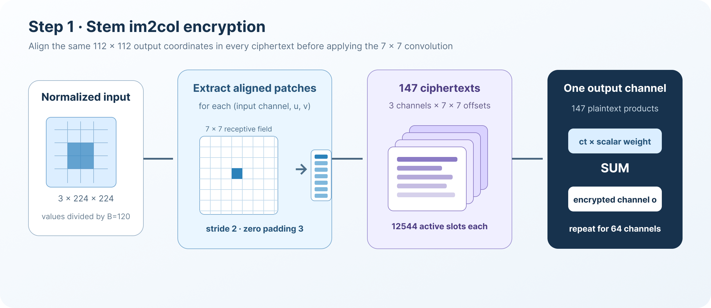
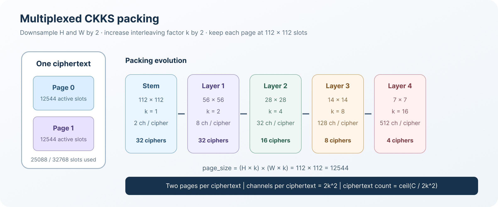
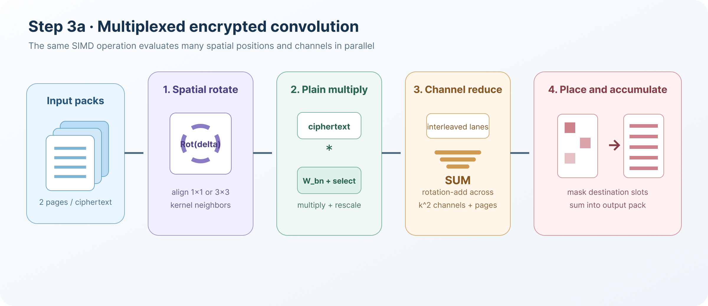

# ResNet-50 密态推理

## 简介

### ResNet-50

ResNet-50 是一个用于图像分类的 50 层卷积神经网络。它的核心结构是*瓶颈残差块（bottleneck residual block）*：主分支依次执行三个卷积，并在最后一次激活前与 shortcut 分支相加：

$$
\mathbf{y} =
\operatorname{ReLU}\left(
F(\mathbf{x};\mathbf{W}) + S(\mathbf{x})
\right).
$$

其中，F 表示由三个卷积组成的瓶颈主分支，S 是恒等映射或投影。`Trident/resnet50` 使用 torchvision 的 ResNet-50参数，将一张 `3 × 224 × 224` 图片分类到 1000 个 ImageNet 类别。


当前实现采用的网络形状如下：

| 网络部分 | Block 数 | 输出形状 |
| --- | ---: | --- |
| Stem：`7×7` 卷积 | 1 | `64 × 112 × 112` |
| Stem：`3×3` 平均池化 | - | `64 × 56 × 56` |
| Layer 1 | 3 | `256 × 56 × 56` |
| Layer 2 | 4 | `512 × 28 × 28` |
| Layer 3 | 6 | `1024 × 14 × 14` |
| Layer 4 | 3 | `2048 × 7 × 7` |
| 全局平均池化 + FC | - | 1000 个 logits |

### 隐私保护推理

在目标数据流中，输入图片和所有中间激活均使用 Poseidon 的 CKKS 实现进行加密。模型参数保持为明文，并被编码为 CKKS 明文乘数。当前研究原型在本地完成输入加密，同时保留私钥和明文参考结果，以便进行逐层正确性验证，因此它还不是 evaluator-only 的生产部署。密文计算路径可以使同态算子无法直接观察输入和中间特征，但不会保护模型权重。

CKKS 支持近似 SIMD 加法和乘法，但不能直接执行比较。因此，标准 ReLU被替换为复合多项式：

$$
\operatorname{ReLU}(x)
\approx x\left(P_3(P_2(P_1(x))) + 0.5\right).
$$

默认的三个多项式分量次数为 `[15, 15, 27]`。在每个 bottleneck 的激活函数之前，程序通过 bootstrapping 恢复可用的模数层级。Stem激活是唯一一个不需要在此前执行 bootstrap 的激活点。

当前密码参数如下：

| 参数 | 当前值 |
| --- | ---: |
| 多项式模数次数 | `N = 2^16` |
| CKKS slots | 32768 |
| 默认 scale | 约 `2^40` |
| Bootstrap EvalMod scale | 约 `2^45` |
| Q 链 | `1 × 45-bit + 20 × 40-bit + 14 × 45-bit`（35 primes / 1475 bit） |
| 特殊模数 P | 默认 `12 × 51-bit` |
| dnum | 默认 3，可选 4 |
| 输入/激活边界 | `B = 120` |
| 逻辑 bootstrap 位置 | 48 |
| 预计单密文 bootstrap 次数 | 351 |

## 实现过程

密态推理包含以下步骤：

1. 对输入图片进行归一化和加密。
2. 计算 stem 卷积，并将结果转换为 multiplexed packing。
3. 计算 16 个密态 bottleneck block。
4. 使用 bootstrapping 恢复模数层级，并计算多项式 ReLU。
5. 计算全局平均池化和 1000 类全连接层。
6. 解密最终 logits，并选择最大值对应的类别。

### 步骤 1：输入预处理与 Stem 加密

每个 ImageNet 样本在 CHW 顺序下包含`3 × 224 × 224 = 150528` 个数值。加密之前，程序将输入值除以全局边界 B=120，使后续中间值保持在多项式 ReLU 的近似区间内。

第一个 `7×7`、stride-2 卷积使用 im2col 布局。对于每一个输入通道和卷积核偏移，对应的图像 patch 被打包到一个密文中：



```text
密文数量 = 3 个输入通道 × 7 × 7 = 147
每个密文的有效 slots = 112 × 112 = 12544
```

对于一个卷积核偏移 (i,u,v)，slot (oh,ow) 保存x[i,2oh+u-3,2ow+v-3]。超出图像边界的位置填充为 0。因此，147 个密文中相同的 slot 都对应相同的输出空间坐标。一个密态输出通道可以在不旋转密文的情况下计算：

$$
\mathrm{ct}_{o}
=
\sum_{i=0}^{2}\sum_{u=0}^{6}\sum_{v=0}^{6}
\mathrm{ct}_{i,u,v}\cdot
\mathrm{pt}\left(W'_{o,i,u,v}\right).
$$

64 个卷积输出最初表示为 64 个密文，每个输出通道对应一个密文。

Batch normalization 的乘法项被融合进卷积权重：
$$
W'_{o,i,u,v} =
W_{o,i,u,v}
\cdot\frac{\gamma_o}{\sqrt{\sigma_o^2+\epsilon}}.
$$

代码中的首层卷积过程如下：

```c++
Im2ColCipherGroup conv1_im2col = encrypt_conv2d_im2col_patches(
    image_values, 224, 224, 3, 2, 7, 7, runtime, plan.log_scale);

ChannelCipherGroup encrypted_stem =
    encrypted_conv2d_im2col_all_channels(
        conv1_im2col, 64, weights.conv_weight[0],
        weights.bn_running_var[0], weights.bn_weight[0],
        kBatchNormEpsilon, runtime);
```

### 步骤 2：Multiplexed 密文打包

网络主体使用 multiplexed 布局。一个密文包含两个 page，每个 page 在空间网格中交织k^2个通道。



对于形状为 `(C, H, W)` 的逻辑张量，布局满足：

```text
每个 page 的通道数 = k^2
page_size            = (H × k) × (W × k)
每个密文的通道数    = 2k^2
密文数量             = ceil(C / (2k^2))
```

逻辑值 `(channel, row, column)` 映射到：

```text
slot = local_page × page_size
     + (row × k + row_offset) × (W × k)
     + (column × k + column_offset)
```

每当 stride-2 操作将 `H` 和 `W` 减半时，程序会将 `k` 加倍。因此，在整个网络中始终有 `H × k = W × k = 112`，每个 page 的大小保持为
12544 slots。

| 位置 | `H×W` | 通道数 | `k` | 密文数 |
| --- | ---: | ---: | ---: | ---: |
| Stem packed | `112×112` | 64 | 1 | 32 |
| Stem 平均池化 | `56×56` | 64 | 2 | 8 |
| Layer 1 输出 | `56×56` | 256 | 2 | 32 |
| Layer 2 输出 | `28×28` | 512 | 4 | 16 |
| Layer 3 输出 | `14×14` | 1024 | 8 | 8 |
| Layer 4 输出 | `7×7` | 2048 | 16 | 4 |

### 步骤 3：密态 Bottleneck Block

每个 bottleneck 计算三个密态卷积。第一个和最后一个卷积使用 `1×1`卷积核，中间卷积使用 `3×3` 卷积核。每个 stage 的第一个 block
还需要计算 projection shortcut。



对于 multiplexed 卷积，程序首先通过空间旋转对齐卷积核所需的相邻位置。每个旋转后的密文与一个明文向量相乘，该向量同时包含卷积权重和融合后的BN scale。随后，rotation-add 对交织的输入通道贡献进行归约，选择 mask再将每个输出通道移动到目标行列偏移和 page。对于输出通道 o 的逻辑位置 (r,c)，密态计算可以表示为：

$$
\mathrm{ct}_{o,r,c}
=
\sum_i\sum_{u,v}
\mathrm{Rot}\left(
\mathrm{ct}_{i},\Delta_{u,v}
\right)
\cdot
\mathrm{pt}\left(W'_{o,i,u,v}\right).
$$

分配到同一目标 pack 的输出通道会被累加到同一个密文中。stride-2卷积每隔一个空间位置进行采样，并将交织因子从 k 调整为 2k。


```text
主分支：
  1×1 conv → BN → bootstrap → polynomial ReLU
  3×3 conv → BN → bootstrap → polynomial ReLU
  1×1 conv → BN ─┐
                 ├→ residual add → bootstrap → polynomial ReLU
Shortcut 分支：──┘
```

密态残差加法首先对齐两条分支的模数层级，再执行 CKKS 动态加法：

```cpp
if (lhs_chain > rhs_chain) {
    evaluator.drop_modulus(lhs_cipher, lhs_cipher, rhs_cipher.parms_id());
} else if (rhs_chain > lhs_chain) {
    evaluator.drop_modulus(rhs_cipher, rhs_cipher, lhs_cipher.parms_id());
}
evaluator.add_dynamic(lhs_cipher, rhs_cipher, output, encoder);
```

卷积、BN、残差加法、bootstrap 和 ReLU 在 block driver 中连接如下：

```cpp
encrypted = multiplexed_channel_conv2d_all_channels(...);
encrypted = multiplexed_channel_batch_norm(...);
encrypted = multiplexed_channel_bootstrap(...);
encrypted = multiplexed_channel_homomorphic_relu(...);

// 第三个卷积之后与 shortcut 相加。
encrypted = multiplexed_channel_add(encrypted, encrypted_shortcut, runtime);
encrypted = multiplexed_channel_bootstrap(...);
encrypted = multiplexed_channel_homomorphic_relu(...);
```

### 步骤 4：多项式 ReLU 与 Bootstrapping

默认 ReLU 配置由三个 Chebyshev 多项式复合而成：


```cpp
relu_config.comp_no = 3;
relu_config.deg = {15, 15, 27};
relu_config.alpha = 13;
relu_config.scaled_val = 1.7;
relu_config.scalingfactor = 40;
```

生成近似 step mask 后，evaluator 将其与密态输入相乘，执行relinearization 和 rescale，并将输出 scale 恢复到约 `2^40`。

Bootstrapping 会分别作用于每一个 packed ciphertext：

```cpp
Ciphertext result = cnn_in.cipher();
evaluator.bootstrap(result, result, relin_keys, galois_keys,
                    encoder, bootstrap_config);
normalize_bootstrap_output_scale(result, bootstrap_context);
```

每个 bottleneck 有三个逻辑 bootstrap 位置，ResNet-50 共包含 16 个 bottleneck。由于一个逻辑张量可能包含多个密文 pack，当前布局预计需要约 351 次单密文 bootstrap。

### 步骤 5：密态分类头

Layer 4 的 `2048 × 7 × 7` 输出位于 4 个密文中。全局平均池化首先按列求和，再按行求和，最后将 2048 个通道值压紧到一个密文的前 2048 个slots 中。程序还会乘以

$$
\frac{B}{H W} = \frac{120}{49}
$$

从而完成平均计算，并恢复此前的全局边界缩放。

对于 1000 个 ImageNet 类别中的每一个类别，全连接层依次执行：

```text
1. 将该类别的 2048 个权重编码为明文向量。
2. 将 packed feature 密文与该向量相乘。
3. 执行 rescale。
4. 按照 1、2、4、...、1024 进行旋转累加。
5. 在 slot 0 中加入该类别的 bias。
```

最终得到 1000 个密文，每个密文的 slot 0 保存一个类别 logit。当前原型解密这些 slots，并通过 `argmax` 得到预测类别。


## 源代码

实现位于 `Trident/resnet50`。

| 文件 | 功能 |
| --- | --- |
| `infer.cpp` | 端到端推理和 bottleneck 执行 |
| `infer_config.*` | 网络常量、CKKS 模数链和 ReLU 参数 |
| `infer_runtime.*` | Poseidon context、encoder、evaluator 和密钥 |
| `encrypted_group_ops.*` | Stem im2col 加密和首层卷积 |
| `multiplexed_ops.*` | Packed 卷积、BN、残差加法、池化和 FC |
| `encrypted_ops.*` | Bootstrap 和 scale 归一化 |
| `relu_approx.*` | 复合多项式 ReLU |
| `parameter_loader.*` | ResNet-50 参数和 ImageNet 输入加载 |
| `plain_cnn.*` | 逐层明文参考计算 |
| `progress_log.*` | 算子耗时、内存和正确性日志 |

主入口为：

```cpp
void ResNet50_imagenet_sparse(
    std::size_t start_image_id,
    std::size_t end_image_id);
```

## 编译与运行

编译 Poseidon，并且只启用 ResNet-50 应用：

```bash
cmake -S . -B build -DCMAKE_BUILD_TYPE=Release
cmake --build build --target poseidon_shared -j4

cmake -S Trident -B Trident/build \
  -DCMAKE_BUILD_TYPE=Release \
  -DCMAKE_CXX_FLAGS="-I$(pwd)/src -L$(pwd)/build -Wl,-rpath,$(pwd)/build" \
  -DBuild_GoogleTest=OFF \
  -DPIR=OFF -DAPSI=OFF -DLR_TRAIN=OFF -DHEARTSTUDY=OFF \
  -DKNN=OFF -DMNIST=OFF -DRESNET20=OFF -DRESNET18=OFF \
  -DRESNET50=ON

cmake --build Trident/build --target resnet50 resnet50_plain -j4
```

首先使用明文参考程序验证输入和权重：

```bash
./Trident/build/resnet50/resnet50_plain 0 0
```

运行一张图片：

```bash
RESNET50_THREADS=8 \
  ./Trident/build/resnet50/resnet50 0 0
```

## 性能

当前代码会将算子耗时、内存快照、逐层误差和最终预测一致性写入：

```text
Trident/resnet50/result/
  resnet50_imagenet_run_START_END_TIMESTAMP.txt
```
